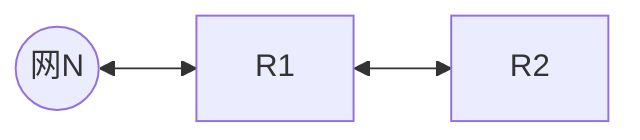

# 第1章 计算机网络体系结构
- [ ] 协议三要素是什么？【P15】
	1. 语法 (Syntax) —— “长什么样？” 	
		- **定义**：数据与控制信息的**结构**或**格式**。 		    
		- **规定内容**：  		    
		    - 数据怎么分段？ 		        
		    - 报文头占几个字节？哪一位代表什么意思？        
		    - 信号的电平是多少伏特？		        
		- **关键词**：**格式 (Format)、编码 (Coding)、信号电平 (Signal Levels)**。		    
		- _类比_：写信时，规定信封右上角贴邮票，中间写地址，最后写邮编。这就是“格式”。	
	2. 语义 (Semantics) —— “什么意思？”	
		- **定义**：发出何种控制信息，完成何种动作以及做出何种响应。		    
		- **规定内容**：		    
		    - 这串二进制代码代表是“连接请求”还是“数据确认”？  
		    - 收到错误数据包后，应该重传还是丢弃？		
		    - 需要做出的动作（如：应答、停止发送）。	        
		- **关键词**：**控制信息 (Control Info)、动作 (Action)、响应 (Response)**。		    
		- _类比_：看到红灯（信号），你知道这代表“停止”（含义），并且你要踩刹车（动作）。    
	
	3. 时序 (Timing) —— “什么顺序？”	
		- _(注：有的教材也翻译为“同步”)_		    
		- **定义**：事件实现**顺序**的详细说明。		    
		- **规定内容**：		    
		    - 谁先发起连接？先发什么，后发什么？		        
		    - **速度匹配**：如果发送方太快，接收方太慢，如何控制速度？		        
		- **关键词**：**顺序 (Order)、速度匹配 (Speed Matching)、排序**。		    
		- _类比_：打电话时，必须先拨号，等对方“喂”一声（建立连接），然后你才能说话。如果你还没拨通就开始说话，就是时序错误。
# 第2章 物理层
- [ ] 奈奎斯特定理和香农定理是什么？【P32】
	- 奈奎斯特定理：$$理想低通信道的极限数据传输速率=2W\log_{2}V$$（单位为 $b/s$）
	- 香农定理：$$信道的极限数据传输速率=Wlog_{2}\left( 1+ \frac{S}{N} \right)$$（单位为 $b/s$，此处信噪比为数值型）
- [ ] 分贝型信噪比如何转换为数值型信噪比？【P32】
	$分贝型=10\times \log_{10}数值型$
- [ ] 如何根据波形图判断数字数据编码方式？【P33】
	![[判断编码方式.png|708x481]]
- [ ] 物理层的接口特性内容是什么？【P44】
	- 机械特性
	- 电气特性
	- 功能特性
	- 过程特性/规程特性
# 第3章-数据链路层
- [ ] 标准以太网，数据编码方式？传输速率为？争用期？帧间最小间隔？
	- 数据编码方式：曼彻斯特编码
	- 传输速率：10 $Mbps$
	- 争用期：51.2 $\mu s$ = 512 比特时间；最小帧长：64 $B$
	- 帧间最小间隔：9.6 $\mu s$ = 96 比特时间，相当于发送96比特的时间
- [ ] SAW、GBN、SR的发送窗口和接收窗口各自的尺寸是多少？发送窗口和接收窗口相互配合向前滑动的细节是什么？如何计算信道利用率？【P62】
	- 窗口尺寸：
		- SAW：$W_T=1$；$W_R=1$
		- GBN：$1<W_T \leq 2^n -1$（采用$n$比特对帧编号）；$W_R=1$
		- SR：$2\leq W_R \leq W_{T}\leq 2^n -2$（采用$n$比特对帧编号）；
	- 窗口滑动的细节：
		- **SAW（停止-等待）**
			- **配合**：一发一收。
			- **接收方**：收到数据帧，校验无误且序号正确 $\to$ 发送$ACK$。
			- **发送方**：必须等到$ACK$回来，才能移动窗口，发送下一帧。
		- **GBN**（后退$N$帧） —— **“累计确认”** + **“只收按序”**
			- **接收方**（$W_R=1$）：
				- 只接收期望的序号
				- 乱序即扔：如果你发了 1, 2, 4, 5。我收了 1, 2，回 ACK2。对于 4 和 5，我直接**丢弃**，并重复发送 ACK2（告诉你我还在等 3）。
			- **发送方** —— **累计确认**
				- 收到$ACK\ k$：表示$k$及以前的所有帧都已由接收方确认。
				- **滑动**：发送窗口的左边缘直接跳到 $k+1$。
				- **超时**：如果超时，重传**所有**已发送但未确认的帧。
		- **SR**（选择重传） —— **“逐个确认”** + **“先收后理”**
			- **接收方**（$W_R\geq 2$）:
				- **来者不拒**：只要序号在接收窗口内，就算乱序也先存下来（缓存），并发送针对该帧的$ACK$。
				- **滑动**：只有当窗口最左边帧收到了，才将窗口向右滑动。
			- 发送方 —— **逐个确认**
				- 收到$ACK\ k$：只标记第$k$号帧“已完成”。
				- **滑动**：只有当**窗口最左边**的帧收到 $ACK$ 时，窗口才向右滑动。如果收到的是中间帧的 $ACK$，窗口**不动**，只是标记一下。
				- **超时**：只重传那个**超时的特定帧**。
	- 信道利用率：
		$$U = \frac{N \times T_{data}}{T_{data} + RTT + T_{ack}}$$
	
- [x] 码分复用【P80】
	为了方便计算，将码片中的0写为-1，将1写为+1.
- [x] CSMA/CD中，最短帧长、数据传输速率、最大单向传播时延、争用期之间的关系是什么？
	$$\begin{align}\text{最短帧长}&=2\tau\times\text{数据传输速率}\\&=2\times\text{最大单向传播时延}\times\text{数据传输速率}\\&=\text{争用期}\times\text{数据传输速率}\end{align}$$
- [x] 捎带确认中确认帧是如何传送的？
	确认帧是通过数据帧来传送的。
- [x] 滑动窗口协议的周期T如何计算？
	永远是从发送第一个数据帧开始到收到第一个确认帧为止的时间。$$T=T_D+RTT+T_A$$
- [ ] 以太网V2标准的MAC帧的格式：【P102】
	[[表格#^565e2a|记忆表格]] ^271f25
- [x] 交换机采用直通交换方式转发一个以太网帧时，说明什么？
	直通交换方式指接收到一帧的同时就立即按该帧的目的MAC地址决定转发接口，故只需要读取以太网帧首部的目的MAC地址（6字节）。
- [x] 海明码的检错和纠错方法是什么？【P59】
	- 确定所需校验位的数目：
		假设信息位$m$位，校验位$r$位，则$2^{r}\geq m+r+1$。（1代表无错误发生的情况）
	- 海明码的检错和纠错能力的判断：
		找最小海明距离，把合理的编码看作分布在1个数轴上面，两个编码之间的最小距离（即编码位不同的最小个数）就是最小海明距离$d$，海明码的检错能力即为$d-1$，纠错能力则是$\left\lfloor  \frac{d}{2}  \right\rfloor$，即从某个合理编码发生错误后，其在数轴上的位置，离其原来位置最近。
- [ ] 802.11数据帧前三个地址的含义分别是什么？【P105】
	- RA（Receiver Address）：因为芯片收到信号第一件事必须判断“是给我的吗？”，不是就扔掉，所以 RA 必须放第一位。
	- SA（Source Address）：因为收到数据后，接收端必须立刻回复 ACK（确认帧），ACK 必须发给刚才那个发信号的人，所以 SA 必须放第二位。
	- DA（Destination Address）
- [ ] PPP协议是什么？【P115】
#  第4章-网络层
- [ ] 虚电路 (VC) 的核心机制是什么？它与数据报和电路交换有何本质区别？【P128】
	- **工作流程（三步走）**：必须经过 **建立连接** (Call Setup) $\to$ **数据传输** $\to$ **释放连接** 三个阶段。（面向连接）。	    
	- **转发依据**：依据 **虚电路号 (VCID)** 进行转发。	    
	    - _注意：VCID 是**逐跳变化**的（Local significance），每经过一个路由器，VCID 都会被替换（Label Swapping）。_ 
	- **特性对比**：	    
	    - **有序性**：所有分组走同一条路 $\to$ **保证有序**。
	    - **可靠性**：脆弱。若中间某个节点/线路故障，经过该节点的所有虚电路**全部中断**（数据报则可以绕路）。	        
	    - **资源分配 (避坑点)**：通常**不预留带宽**（使用统计复用），这一点不同于电路交换。	        
	- **与数据报的区别**：	    
	    - 数据报：无连接、独立路由、不保序、每个包带全地址。  
	    - 虚电路：有连接、固定路径、保序、包头带 VCID。
- [ ] 动态主机配置协议DHCP的配置过程是什么？【P148】
	![[DHCP.png]]
- [ ] MTU是什么？
	![[区分MTU和MSS.png]]MTU(Maximum Transmission Unit)的中文是“最大传输单元”。它指的是在网络中，**数据链路层**（OSI模型的第二层，例如以太网）一次所能传输的**最大数据包大小**，单位是字节（Bytes）。
- [x] IPv4分组的首部校验和如何计算？
	1. IPv4分组首部校验和是16位，<mark style="background: #ADCCFFA6;">只校验数据报的首部，不包括数据部分；</mark>
	2. 二进制反码求和规则：从低位到高位逐列进行计算，0和0相加是0,0和1相加是1,1和1相加是0，但要产生一个进位1，加到下列，若最高位相加后产生进位，则最后得到的结果要加1；
	3. 在二进制反码运算中，0有两种表示法：全0和全1(正零和负零)。
	4. 与UDP和TCP的检验和计算不同，不需要加入伪首部。
	5. 发送方：为了计算IP首部校验和字段的值，先把首部的校验和字段设为0，然后计算整个首部（包括选项）的二进制反码的和。把首部作为一个16bit整数数组来处理。让我们把这个计算结果称为a，因为校验和字段被明确设为0，所以a是除了校验和字段以外所有IP首部字段的和。a的二进制反码，用-a表示，被放在校验和字段中，发送该分组。
- [ ] 私有IP地址为：
	- 10.0.0.0/8，相当于1个A类网络。
	- <mark style="background: #ADCCFFA6;">172.16.0.0/12</mark>，相当于16个B类网络。
	- 192.168.0.0/16，相当于256个连续的C类网络。
- [ ]  RIP、BGP、OSPF、ICMP、SMTP、POP3
	![[各协议信息汇总图.png]]
- [x] 若网络层发现检验和错误，该如何处理？
	立即丢弃该数据包，且不发送ICMP差错报文。
- [x] 片偏移有什么特点？
	以8$B$为偏移单位；除最后一个分片外，每个分片的长度一定是8$B$的整数倍。
- [x] 路由表中，当目标网络是本地网络（直接相连）时，下一跳IP地址该如何填写？
	填 `-` / `On-link` / `0.0.0.0`
- [x]  路由表中，当目标网络是互联网时，如何配置路由？
	相当于配置一个默认路由（当某一目的IP地址与路由表中其他任何表项都不匹配时，则匹配该默认路由。互联网包括了无数的网络集合，不可能在路由表项中一一列出，因此只能采用默认路由的方式）。
- [ ] RIP的收敛过程是如何进行的？【P186】
	对每个相邻路由器发送来的RIP报文，执行如下步骤：
	1. 对地址为X的相邻路由器发来的RIP报文，先修改该报文中的所有项目：把“下一跳”字段中的地址都改为X，并把所有“距离”字段的值加1。
	2. 对修改后的RIP报文中的每个项目，执行如下步骤：
		- 若原来的路由表中没有目的网络N：则把该项目添加到路由表中；
		- 若原来的路由表中有目的网络N，且下一跳路由器的地址是X：用收到的项目替换原路由表中的项目；
		- 若原来的路由表中有目的网络N，且下一跳路由器的地址不是X：若收到的项目中的距离d小于路由表中的距离，则进行更新。
- [ ] 采用RIP的自治系统，某时刻，其中的路由器R1检测到网络N不可达，计算R1到N的最新距离为？
	$\text{R1计算到N的最新距离}=min\{16,1+R2到N的距离\}$ 

- [ ] ICMP差错报文中，终点不可达、源点抑制、时间超过、参数问题、改变路由（重定向）这些类型的差错报告报文在什么情况下使用？【P149】
- [x] 各种中继设备对冲突与/广播域的划分是什么样的呢？
	![[各种中继设备对冲突域广播域的划分.webp]]
- [ ] NAT是什么？【P140】
	- NAT转换表存放着{本地IP地址：端口}到{全球IP地址：端口}的映射。
# 第5章-传输层
- [ ] TCP【P233】
- [x] 进行拥塞控制的TCP协议中，发送方还能发送的最大字节数该如何计算？
	1. 计算出发送方的发送窗口大小；
	2. 减去已经发送但还未被确认的字节数。
- [ ] 传输层的面向连接服务的特性是什么？
	保证可靠和顺序交付
- [x] 若UDP检验和计算结果为0，则在检验和字段填充什么呢？
	UDP检验和不是必需的，若不使用检验和，则将检验和字段设置为0。而若检验和的计算结果恰好为0，则将检验和字段设置为全1。
- [x] 在进行跨网络的IP通信时，不考虑NAT，传输层使用UDP进行封装，数据链路层采用以太网MAC帧进行封装，则下列字段中一定保持不变的是（)。I. UDP总长度  Ⅱ. UDP检验和  Ⅲ. FCS帧检验序列  IV. 目的MAC地址  V. 目的IP地址  VI. IP检验和
	只有目的IP地址一定不变。若数据在传输过程中受到链路MTU的限制，则需要分片处理，于是UDP总长度发生变化，相应的UDP检验和、IP检验和、FCS帧检验序列都会重新计算，在不同的链路上，目的MAC地址都有所不同。
# 第6章 应用层
- [ ] 域名服务器解析域名为www.abc.xyz.com的网站时，采用迭代查询方式，可能发出的DNS查询的最少和最多次数分别为多少？【P269】
	0次：本机缓存中包含域名映射；
	4次：根域名服务器 -> 顶级域名服务器（com） -> 权限域名服务器（xyz.com） -> 权限域名服务器（abc.xyz.com）
- [ ] FTP的基本工作原理是什么？【P273】
	![[FTP的基本工作原理.jpeg]]
	- 数据连接在文件传输完时就关闭了；
	- 控制连接会一直连接，可以让服务器从文件断点字节位置续传；