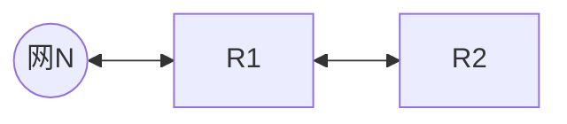

# 第1章 计算机网络体系结构
- [ ] 网络各层数据单元的关系是什么？【P15】
	$n-SDU+n-PCI=n-PDU=(n-1)-SDU$
- [ ] 协议三要素是什么？【P15】
	1. 语法 (Syntax) —— “长什么样？” 	
		- **定义**：数据与控制信息的**结构**或**格式**。 		    
		- **规定内容**：  		    
		    - 数据怎么分段？ 		        
		    - 报文头占几个字节？哪一位代表什么意思？        
		    - 信号的电平是多少伏特？		        
		- **关键词**：**格式 (Format)、编码 (Coding)、信号电平 (Signal Levels)**。		    
		- _类比_：写信时，规定信封右上角贴邮票，中间写地址，最后写邮编。这就是“格式”。	
	2. 语义 (Semantics) —— “什么意思？”	
		- **定义**：发出何种控制信息，完成何种动作以及做出何种响应。		    
		- **规定内容**：		    
		    - 这串二进制代码代表是“连接请求”还是“数据确认”？  
		    - 收到错误数据包后，应该重传还是丢弃？		
		    - 需要做出的动作（如：应答、停止发送）。	        
		- **关键词**：**控制信息 (Control Info)、动作 (Action)、响应 (Response)**。		    
		- _类比_：看到红灯（信号），你知道这代表“停止”（含义），并且你要踩刹车（动作）。    
	3. 时序 (Timing) —— “什么顺序？”	
		- _(注：有的教材也翻译为“同步”)_		    
		- **定义**：事件实现**顺序**的详细说明。		    
		- **规定内容**：		    
		    - 谁先发起连接？先发什么，后发什么？		        
		    - **速度匹配**：如果发送方太快，接收方太慢，如何控制速度？		        
		- **关键词**：**顺序 (Order)、速度匹配 (Speed Matching)、排序**。		    
		- _类比_：打电话时，必须先拨号，等对方“喂”一声（建立连接），然后你才能说话。如果你还没拨通就开始说话，就是时序错误。
- [ ] TCP/IP 模型分为哪四层？它们分别处理什么单位的数据？【P19】
	TCP/IP 模型（从上到下）：	
	1. **应用层 (Application Layer)**：处理特定的业务逻辑（HTTP, FTP）。数据叫 **报文 (Message)**。	    
	2. **传输层 (Transport Layer)**：负责**端到端**通信。数据叫 **段 (Segment)** (TCP) 或 **用户数据报** (UDP)。	    
	3. **网际层 (Internet Layer)**：负责路由选择和**点到点**（主机到主机）的分组转发。数据叫 **IP 数据报 / 分组 (Packet)**。	    
	4. **网络接口层 (Network Interface Layer)**：负责物理传输。数据叫 **帧 (Frame)**。
- [ ] 简述5 层协议架构【P21】
	这是 TCP/IP 和 OSI 的折中：	
	1. **应用层 (Application)**：对应 OSI 的应用层、表示层、会话层。	    
	2. **传输层 (Transport)**：对应 OSI 的传输层。**(核心：端到端)**	    
	3. **网络层 (Network)**：对应 OSI 的网络层。**(核心：点到点 / 主机到主机)**	    
	4. **数据链路层 (Data Link)**：对应 OSI 的数据链路层。**(核心：节点到节点)**	    
	5. **物理层 (Physical)**：对应 OSI 的物理层。
# 第2章 物理层
- [ ] 奈奎斯特定理和香农定理是什么？【P32】
	- 奈奎斯特定理：$$理想低通信道的极限数据传输速率=2W\log_{2}V$$（单位为 $b/s$）
	- 香农定理：$$信道的极限数据传输速率=Wlog_{2}\left( 1+ \frac{S}{N} \right)$$（单位为 $b/s$，此处信噪比为数值型）
	- QAM调制：比特数 = $\log_2 (\text{QAM等级})$
- [ ] 分贝型信噪比如何转换为数值型信噪比？【P32】
	$分贝型=10\times \log_{10}数值型$
- [ ] 如何根据波形图判断数字数据编码方式？【P33】
	![[判断编码方式.png|708x481]]
- [ ] 物理层的接口特性内容是什么？【P44】
	- 机械特性
	- 电气特性
	- 功能特性
	- 过程特性/规程特性
# 第3章-数据链路层
- [ ] 标准以太网，数据编码方式？传输速率为？争用期？帧间最小间隔？
	- 数据编码方式：**曼彻斯特编码**
	- 传输速率：10 $Mbps$
	- 争用期：51.2 $\mu s$ = 512 比特时间；最小帧长：64 $B$
	- 帧间最小间隔：9.6 $\mu s$ = 96 比特时间，相当于发送96比特的时间
- [ ] SAW、GBN、SR的发送窗口和接收窗口各自的尺寸是多少？发送窗口和接收窗口相互配合向前滑动的细节是什么？如何计算信道利用率？【P62】
	- 窗口尺寸：
		- SAW：$W_T=1$；$W_R=1$
		- GBN：$1<W_T \leq 2^n -1$（采用$n$比特对帧编号）；$W_R=1$
		- SR：$2\leq W_R \leq W_{T}\leq 2^n -2$（采用$n$比特对帧编号）；
	- 窗口滑动的细节：
		- **SAW（停止-等待）**
			- **配合**：一发一收。
			- **接收方**：收到数据帧，校验无误且序号正确 $\to$ 发送$ACK$。
			- **发送方**：必须等到$ACK$回来，才能移动窗口，发送下一帧。
		- **GBN**（后退$N$帧） —— **“累计确认”** + **“只收按序”**
			- **接收方**（$W_R=1$）：
				- 只接收期望的序号
				- 乱序即扔：如果你发了 1, 2, 4, 5。我收了 1, 2，回 ACK2。对于 4 和 5，我直接**丢弃**，并重复发送 ACK2（告诉你我还在等 3）。
			- **发送方** —— **累计确认**
				- 收到$ACK\ k$：表示$k$及以前的所有帧都已由接收方确认。
				- **滑动**：发送窗口的左边缘直接跳到 $k+1$。
				- **超时**：如果超时，重传**所有**已发送但未确认的帧。
		- **SR**（选择重传） —— **“逐个确认”** + **“先收后理”**
			- **接收方**（$W_R\geq 2$）:
				- **来者不拒**：只要序号在接收窗口内，就算乱序也先存下来（缓存），并发送针对该帧的$ACK$。
				- **滑动**：只有当窗口最左边帧收到了，才将窗口向右滑动。
			- 发送方 —— **逐个确认**
				- 收到$ACK\ k$：只标记第$k$号帧“已完成”。
				- **滑动**：只有当**窗口最左边**的帧收到 $ACK$ 时，窗口才向右滑动。如果收到的是中间帧的 $ACK$，窗口**不动**，只是标记一下。
				- **超时**：只重传那个**超时的特定帧**。
	- 信道利用率：
		$$U = \frac{N \times T_{data}}{T_{data} + RTT + T_{ack}}$$
- [ ] 码分复用【P80】
	为了方便计算，将码片中的0写为-1，将1写为+1.
- [ ] CSMA/CD中，最短帧长、数据传输速率、最大单向传播时延、争用期之间的关系是什么？
	$$\begin{align}\text{最短帧长}&=2\tau\times\text{数据传输速率}\\&=2\times\text{最大单向传播时延}\times\text{数据传输速率}\\&=\text{争用期}\times\text{数据传输速率}\end{align}$$
- [ ] CSMA/CD中使用的二进制指数退避算法是什么？【P84】
	- [ ] 退避时间（等待时间）具体是怎么计算的？(核心
		退避时间 = **随机数 $r$** $\times$ **基本退避时间 ($2\tau$)**。	
		1. **基本退避时间**：取值为 **争用期 ($2\tau$)**。	    
		    - 对于 10Mbps 以太网，争用期是 $51.2 \mu s$（即 512 bit 时间）。		        
		2. **随机数 $r$**：从离散整数集合 $[0, 1, \dots, (2^k - 1)]$ 中随机取出一个数。	    
		    - 所以，$r$ 的取值范围由参数 $k$ 决定。
	- [ ] 参数 $k$ 是怎么确定的？
		$$k = \min(\text{重传次数}, 10)$$
	- [ ] 算法中有哪两个重要的“临界数字”？
		- **10 (停止增长上限)**：		    
		    - 当重传次数超过 10 次时，集合范围不再扩大，始终维持在 $[0, 2^{10}-1]$。
		- **16 (放弃上限)**：		    
		    - 当重传次数达到 **16 次** 仍不能成功时，协议决定**放弃传输**，并向高层报错。
- [ ] CSMA/CA中使用的二进制指数退避算法是什么？【P86】
	- $[0, 1, \dots, (2^{2+k} - 1)]$，k最大为6，即范围最大为255
	- 冻结机制
- [ ] 捎带确认中确认帧是如何传送的？
	确认帧是通过数据帧来传送的。
- [ ] 滑动窗口协议的周期T如何计算？
	永远是从发送第一个数据帧开始到收到第一个确认帧为止的时间。$$T=T_D+RTT+T_A$$
- [ ] 以太网V2标准的MAC帧的格式：【P102】
	[[表格#^565e2a|记忆表格]] ^271f25
- [ ] 交换机采用直通交换方式转发一个以太网帧时，说明什么？
	直通交换方式指接收到一帧的同时就立即按该帧的目的MAC地址决定转发接口，故只需要读取以太网帧首部的目的MAC地址（6字节）。
- [ ] CRC的计算是如何进行的？【P59】
	- 在发送数据的后面补上 **$r$ 个 0**（$r$ 是多项式的阶数，不是除数的长度）。
	- 不做减法，只做异或。
- [ ] 海明码的检错和纠错方法是什么？【P59】
	- 确定所需校验位的数目：
		假设信息位$m$位，校验位$r$位，则$2^{r}\geq m+r+1$。（1代表无错误发生的情况）
	- 海明码的检错和纠错能力的判断：
		找最小海明距离，把合理的编码看作分布在1个数轴上面，两个编码之间的最小距离（即编码位不同的最小个数）就是最小海明距离$d$，海明码的检错能力即为$d-1$，纠错能力则是$\left\lfloor  \frac{d}{2}  \right\rfloor$，即从某个合理编码发生错误后，其在数轴上的位置，离其原来位置最近。
- [ ] 802.11数据帧前三个地址的含义分别是什么？【P105】
	- RA（Receiver Address）：因为芯片收到信号第一件事必须判断“是给我的吗？”，不是就扔掉，所以 RA 必须放第一位。
	- TA（Transmitter Address 发送端地址）**：因为收到数据后，接收端必须立刻回复 ACK（确认帧），ACK 必须发给刚才那个发信号的人，所以 TA 必须放第二位。
	- “彼岸”
- [ ] PPP协议是什么？【P115】
	- PPP 协议由哪三个核心部分组成？
		- **将 IP 数据报封装到串行链路的方法**：定义了帧格式。		    
		- **链路控制协议 (LCP, Link Control Protocol)**：		    
		    - **作用**：建立、配置和测试数据链路连接。		        
		    - _身份验证_（PAP/CHAP）就是在这一步协商的。		        
		- **网络控制协议 (NCP, Network Control Protocol)**：		    
		    - **作用**：支持不同的网络层协议（如 IP、OSI、AppleTalk）。		        
		    - _核心_：PPP 是**面向多协议**的，它不仅能传 IP 包，也能传其他协议的包，都要归功于 NCP。
	- PPP 协议是“面向字节”还是“面向比特”的？
		- **面向字节 (Byte-oriented)**。
			- PPP 的帧长度必须是**整字节数**。		    
			- 它处理数据的单位也是字节，而不是比特流（HDLC 是面向比特的）。
	- PPP 如何实现“透明传输”？(0x7E 冲突了怎么办？)
		- PPP 的帧定界符是 `0x7E` (01111110)。如果数据里也刚好有这个数，为了不让接收端误以为帧结束了，需要进行转义。
			- **异步传输 (如拨号上网)**：使用 **字节填充法 (Byte Stuffing)**。	
				- 加 ESC (`0x7D`)，**且必须修改数值（异或 0x20）**。（`7D 5E`）
			    - 遇到 `0x7E` $\to$ 转义为 `0x7D, 0x5E`。			        
			    - 遇到 `0x7D` $\to$ 转义为 `0x7D, 0x5D`。			        
			- **同步传输 (如 SONET/SDH 光纤)**：使用 **零比特填充法 (Zero-bit Stuffing)**。			    
			    - 遇到 5 个连续的 `1`，自动填入一个 `0`（同 HDLC）。
	- PPP 协议提供“可靠传输”吗？
		- **不提供。**
			- PPP 是 **不可靠** 的传输协议。			    
			- 它只负责 **检错 (CRC)**（查出错了就丢弃），**不负责纠错**，也 **不负责流量控制**（没有滑动窗口机制）。	
			- _原因_：在广域网中，为了追求速度和低开销，纠错任务通常交给上层（TCP）去做。
	- PPP 的工作状态流转是怎样的？
		- 静止 (Dead) $\xrightarrow{物理层激活}$ 建立 (Establish) $\xrightarrow{LCP协商}$ 鉴别 (Authenticate) $\xrightarrow{NCP配置}$ **打开 (Open/数据传输)**。
#  第4章-网络层
- [ ] 虚电路 (VC) 的核心机制是什么？它与数据报和电路交换有何本质区别？【P128】
	- **工作流程（三步走）**：必须经过 **建立连接** (Call Setup) $\to$ **数据传输** $\to$ **释放连接** 三个阶段。（面向连接）。	    
	- **转发依据**：依据 **虚电路号 (VCID)** 进行转发。	    
	    - _注意：VCID 是**逐跳变化**的（Local significance），每经过一个路由器，VCID 都会被替换（Label Swapping）。_ 
	- **特性对比**：	    
	    - **有序性**：所有分组走同一条路 $\to$ **保证有序**。
	    - **可靠性**：脆弱。若中间某个节点/线路故障，经过该节点的所有虚电路**全部中断**（数据报则可以绕路）。	        
	    - **资源分配 (避坑点)**：通常**不预留带宽**（使用统计复用），这一点不同于电路交换。	        
	- **与数据报的区别**：	    
	    - 数据报：无连接、独立路由、不保序、每个包带全地址。  
	    - 虚电路：有连接、固定路径、保序、包头带 VCID。
- [ ] SDN（软件定义网络）中，什么是“北向接口”和“南向接口”？【P131】
	以 **控制层 (SDN 控制器)** 为中心：	
	- **北向接口 (Northbound API)**：控制器 $\leftrightarrow$ **上层应用**。	    
	    - _作用_：让应用告诉控制器“我想要什么样的网络服务”。	        
	    - _特点_：目前通常是 RESTful API，尚未完全标准化。	        
	- **南向接口 (Southbound API)**：控制器 $\leftrightarrow$ **下层交换机**。	    
	    - _作用_：控制器给交换机下达命令（下发流表），交换机向控制器汇报状态。	        
	    - _典型协议_：**OpenFlow**。
- [ ] 动态主机配置协议DHCP的配置过程是什么？【P148】
	![[DHCP.png]]
	**DORA**
	1. **D**iscover (发现)：客户找服务器。	    
	2. **O**ffer (提供)：服务器给预案。	    
	3. **R**equest (请求)：客户选定并告知所有服务器。	    
	4. **A**ck (确认)：服务器正式通过。
- [ ] MTU是什么？
	![[区分MTU和MSS.png]]MTU(Maximum Transmission Unit)的中文是“最大传输单元”。它指的是在网络中，**数据链路层**（OSI模型的第二层，例如以太网）一次所能传输的**最大数据包大小**，单位是字节（Bytes）。
- [ ] IPv4分组的首部校验和如何计算？
	1. IPv4分组首部校验和是16位，<mark style="background: #ADCCFFA6;">只校验数据报的首部，不包括数据部分；</mark>
	2. 二进制反码求和规则：从低位到高位逐列进行计算，0和0相加是0,0和1相加是1,1和1相加是0，但要产生一个进位1，加到下列，若最高位相加后产生进位，则最后得到的结果要加1；
	3. 在二进制反码运算中，0有两种表示法：全0和全1(正零和负零)。
	4. 与UDP和TCP的检验和计算不同，不需要加入伪首部。
	5. 发送方：为了计算IP首部校验和字段的值，先把首部的校验和字段设为0，然后计算整个首部（包括选项）的二进制反码的和。把首部作为一个16bit整数数组来处理。让我们把这个计算结果称为a，因为校验和字段被明确设为0，所以a是除了校验和字段以外所有IP首部字段的和。a的二进制反码，用-a表示，被放在校验和字段中，发送该分组。
- [ ] IPv6【P178】
	- [ ] IPv6 的地址空间到底有多大？
		- **长度**：**128 位 (16 字节)**。（IPv4 是 32 位）。    
		- **总量**：$2^{128}$。号称“可以给地球上的每一粒沙子都分配一个 IP”。    
		- **表示法**：**冒号十六进制** (e.g., `2001:0DB8::1`)。    
		- **压缩规则**：    
		    1. 每段开头的 0 可以省略。        
		    2. 连续的 0 段可以用双冒号 `::` 表示，但 **全地址只能用一次** `::` (防止歧义)。
	- [ ] IPv6 的首部格式相比 IPv4 做了哪些重大改进？
		核心目的是 **“为了让路由器转发得更快”**。
		1. **固定首部长度**：IPv6 首部固定为 **40 字节**（IPv4 是 20+变长）。路由器不用再计算首部到底多长了。    
		2. **取消了首部校验和 (Checksum)**：这也是为了快。因为二层（数据链路层）和四层（传输层）都有校验，网络层没必要重复做。    
		3. **取消了分片/重组字段**：    
		    - **IPv6 路由器不再负责分片！**        
		    - 如果包太大，路由器直接丢弃并回传 ICMPv6 报错（Packet Too Big）。        
		    - **分片工作由“源主机”完成**。
	- [ ] IPv6 还有“广播 (Broadcast)”吗？
		**彻底取消了。**
		- IPv6 没有广播地址，也没有 ARP 协议。    
		- **替代方案**：它的功能被 **多播 (Multicast)** 接管了。    
		- **三种通信方式**：    
		    1. **单播 (Unicast)**：点对点。        
		    2. **多播 (Multicast)**：一点对多点（一组）。        
		    3. **任播 (Anycast)**：**一点对“最近”的一个点**。（这是 IPv6 的新特性，比如找最近的 DNS 服务器）。
	- [ ] IPv6 如何支持扩展功能？(Next Header)
		IPv6 采用了 **“扩展首部”** 机制。
		- 基本首部中有一个 **“下一个首部 (Next Header)”** 字段。
		- 它像链表一样，指向后续的扩展首部（如路由首部、分片首部、认证首部）。    
		- 路由器通常只处理基本首部，只有目的主机才处理扩展首部（除了“逐跳选项”），大大提高了中间节点的效率。
	- [ ] 从 IPv4 过渡到 IPv6 有哪三种主流策略？
		- **双协议栈 (Dual Stack)**：设备同时装有 IPv4 和 IPv6 两套协议栈，既能通 v4 也能通 v6。    
		- **隧道技术 (Tunneling)**：**“车拉船”**。把 IPv6 的报文封装在 IPv4 的数据部分里，穿过旧的 IPv4 网络。    
		- **网络地址转换 (NAT-PT)**：在网关处进行 v4 和 v6 的地址翻译（效率最低）。
- [ ] 私有IP地址为：
	- 10.0.0.0/8，相当于1个A类网络。
	- <mark style="background: #ADCCFFA6;">172.16.0.0/12</mark>，相当于16个B类网络。
	- 192.168.0.0/16，相当于256个连续的C类网络。
- [ ]  若网络层发现检验和错误，该如何处理？
	立即丢弃该数据包，且不发送ICMP差错报文。
- [ ] 片偏移有什么特点？
	以8$B$为偏移单位；除最后一个分片外，每个分片的长度一定是8$B$的整数倍。
- [ ] 路由表中，当目标网络是本地网络（直接相连）时，下一跳IP地址该如何填写？
	填 `-` / `On-link` / `0.0.0.0`
- [ ] 路由表中，当目标网络是互联网时，如何配置路由？
	相当于配置一个默认路由（当某一目的IP地址与路由表中其他任何表项都不匹配时，则匹配该默认路由。互联网包括了无数的网络集合，不可能在路由表项中一一列出，因此只能采用默认路由的方式）。
- [ ] RIP、BGP、OSPF、ICMP、SMTP、POP3、DNS、FTP
	![[各协议信息汇总图.png]]

- [ ] RIP的收敛过程是如何进行的？【P186】
	对每个相邻路由器发送来的RIP报文，执行如下步骤：
	1. 对地址为X的相邻路由器发来的RIP报文，先修改该报文中的所有项目：把“下一跳”字段中的地址都改为X，并把所有“距离”字段的值加1。
	2. 对修改后的RIP报文中的每个项目，执行如下步骤：
		- 若原来的路由表中没有目的网络N：则把该项目添加到路由表中；
		- 若原来的路由表中有目的网络N，且下一跳路由器的地址是X：用收到的项目替换原路由表中的项目；
		- 若原来的路由表中有目的网络N，且下一跳路由器的地址不是X：若收到的项目中的距离d小于路由表中的距离，则进行更新。
- [ ] 采用RIP的自治系统，某时刻，其中的路由器R1检测到网络N不可达，计算R1到N的最新距离为？
	$\text{R1计算到N的最新距离}=min\{16,1+R2到N的距离\}$ 

- [ ] ICMP差错报文中，终点不可达、源点抑制、时间超过、参数问题、改变路由（重定向）这些类型的差错报告报文在什么情况下使用？【P149】
- [ ] 各种中继设备对冲突与/广播域的划分是什么样的呢？
	![[各种中继设备对冲突域广播域的划分.webp]]
- [ ] NAT是什么？【P140】
	- NAT转换表存放着{本地IP地址：端口}到{全球IP地址：端口}的映射。
# 第5章-传输层
- [ ] 进行拥塞控制的TCP协议中，发送方还能发送的最大字节数该如何计算？
	1. 计算出发送方的发送窗口大小；
	2. 减去已经发送但还未被确认的字节数。
- [ ] 传输层的面向连接服务的特性是什么？
	保证可靠和顺序交付
- [ ] UDP的首部格式和各字段意义是什么？【P227】
	1. 源端口号 (Source Port)	
		- **长度**：2 字节 (16位)。		    
		- **意义**：发送方进程的端口号。		    
		- **考点细节**：在 UDP 中，这个字段是 **可选的**。	    
		    - 如果发送方不需要接收方的回复（比如单纯的广播），这里可以全填 `0`。		        
		    - 如果需要回复，这就相当于“发件人地址”，接收方会根据这个端口回发数据。        
	2. 目的端口号 (Destination Port)	
		- **长度**：2 字节 (16位)。		    
		- **意义**：接收方进程的端口号。		    
		- **考点细节**：这是 **必须** 的。如果接收方主机收到 UDP 报文，发现这个目的端口没有对应的进程在监听，就会丢弃该报文，并向发送方回发一个 **ICMP 端口不可达** 差错报文（注意：是 ICMP 报文，不是 UDP 报文）。
	3. 长度 (Length)	
		- **长度**：2 字节 (16位)。	    
		- **意义**：**UDP 用户数据报的总长度**（包括 首部 + 数据）。
		- **考点细节**：	    
		    - **最小值**：**8**。这意味着数据部分为空，只发了一个 8 字节的空首部。	        
		    - 这个字段其实有点冗余，因为通过 IP 首部中的“总长度”减去 IP 首部长度，也能算出来 UDP 的长度。但 UDP 还是保留了它。        
	4. 校验和 (Checksum) —— 最复杂的字段	
		- **长度**：2 字节 (16位)。		    
		- **意义**：检测 UDP 用户数据报在传输中是否有错。	    
		- **考点细节**：		    
		    - **有错怎么办？** 如果接收方校验发现出错，直接 **丢弃**，通常不通知发送方。		        
		    - **可选性**：在 IPv4 中，UDP 校验和是可选的（不想算就填全 0）；但在 IPv6 中是强制的。        
		    - **计算范围**：校验和不仅覆盖 **UDP 首部** 和 **UDP 数据**，还要加上一个 **“伪首部” (Pseudo Header)**（源IP地址4B+目的IP地址4B+0+17+UDP长度2B）。
- [ ] 若UDP检验和计算结果为0，则在检验和字段填充什么呢？
	UDP检验和不是必需的，若不使用检验和，则将检验和字段设置为0。而若检验和的计算结果恰好为0，则将检验和字段设置为全1。
- [ ] TCP首部长度的是多大？TCP链接建立和释放过程中状态的转换【P233、P236】
	20B ~ 60B
- [ ] TCP拥塞控制中拥塞避免、快重传和快恢复的过程是怎样的？【P242】
	- 拥塞避免：每收到一个ACK，cwnd增加1/cwnd的大小。
	- 快重传：使发送方尽早进行重传，而不等超时计时器超时再重传。这就要求接收方不要等待自己发送数据时才进行稍待确认，而要立即发送确认，即使收到了失序的报文段也要立即发出对已收到的报文段的重复确认。
	- 快恢复：发送方连续收到3个冗余ACK时，将慢开始门限ssthresh调整为当前cwnd的一半，cwnd也调整为当前cwnd的一半，然后开始执行拥塞避免算法。
- [ ] 在进行跨网络的IP通信时，不考虑NAT，传输层使用UDP进行封装，数据链路层采用以太网MAC帧进行封装，则下列字段中一定保持不变的是（)。I. UDP总长度  Ⅱ. UDP检验和  Ⅲ. FCS帧检验序列  IV. 目的MAC地址  V. 目的IP地址  VI. IP检验和
	只有目的IP地址一定不变。若数据在传输过程中受到链路MTU的限制，则需要分片处理，于是UDP总长度发生变化，相应的UDP检验和、IP检验和、FCS帧检验序列都会重新计算，在不同的链路上，目的MAC地址都有所不同。
# 第6章 应用层
- [ ] 域名服务器解析域名为www.abc.xyz.com的网站时，采用迭代查询方式，可能发出的DNS查询的最少和最多次数分别为多少？【P269】
	最少：本机缓存中包含域名映射；
	最多：本地域名服务器 -> 根域名服务器 -> 顶级域名服务器（com） -> 权限域名服务器（xyz.com） -> 权限域名服务器（abc.xyz.com）
	如果缓存知道其中的某个服务器地址，可跳过前面的查询。
- [ ] FTP的基本工作原理是什么？【P273】
	![[FTP的基本工作原理.jpeg]]
	- 数据连接在文件传输完时就关闭了；
	- 控制连接会一直连接，可以让服务器从文件断点字节位置续传；
- [ ] HTTP/1.0和HTTP/1.1分别指什么？【P288】
	- HTTP/1.0指非持续连接。
	- HTTP/1.1指持续连接。