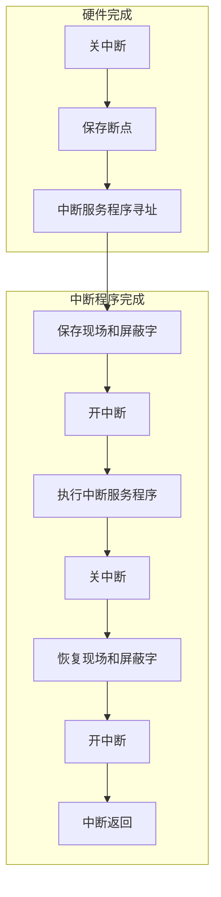

1. [[01-计组知识点#^1def12|中断处理的过程]]^54d390
	**设置新的屏蔽字 (IMR)**：	
	- 写入一个新的“黑名单”。	    
	- 规则：**屏蔽自己 + 屏蔽所有优先级 $\le N$ 的中断**。	    
	- _目的：确保接下来开了总开关后，只有比我高级的才能进来。_

```mermaid
%% 标题：图 7.4 一个可嵌套中断的典型处理流程
graph TB
    %% 设置流程图方向为从上到下

    %% 定义节点
    A["关中断"]
    B["保存断点"]
    C["中断服务程序寻址"]
    D["保存现场和屏蔽字"]
    E["开中断"]
    F["执行中断服务程序"]
    G["关中断"]
    H["恢复现场和屏蔽字"]
    I["开中断"]
    J["中断返回"]

    %% 定义流程连接
    A --> B
    B --> C
    C --> D
    D --> E
    E --> F
    F --> G
    G --> H
    H --> I
    I --> J

    %% 使用 subgraph 定义右侧的分组
    subgraph "硬件完成"
        direction TB
        A
        B
        C
    end

    subgraph "中断程序完成"
        direction TB
        D
        E
        F
        G
        H
        I
        J
    end
```
